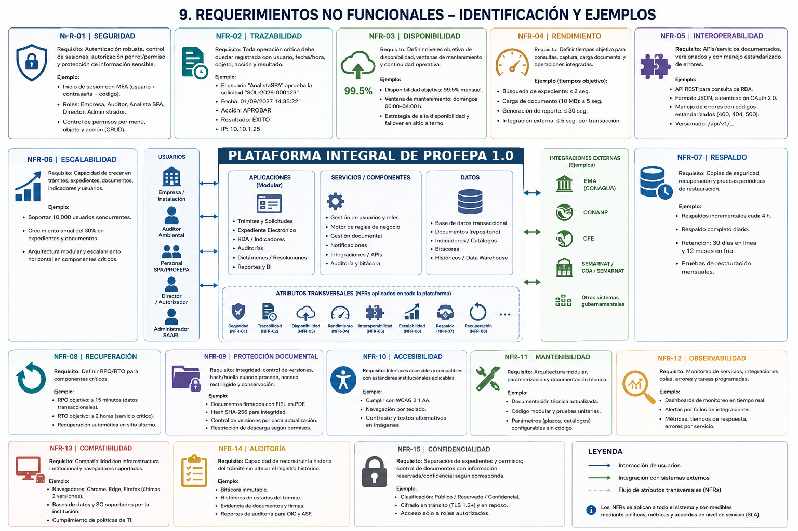

# Plataforma Integral de PROFEPA 1.0 — Análisis de Requerimientos y Procesos

**Versión documental:** 1.0  
**Fecha de migración:** 1 de septiembre de 2026  
**Repositorio:** `profepa`  
**Propósito:** Baseline documental y técnica inicial de la Plataforma Integral de PROFEPA 1.0.

> Esta versión Markdown se genera a partir del documento Word actualizado. El Word institucional se conserva en `anexos/word/`.

## Diagrama de referencia



Plataforma Integral de PROFEPA 1.0

ANÁLISIS DE REQUERIMIENTOS FUNCIONALES Y MODELADO DE PROCESOS

Subprocuraduría de Prevención Ambiental (SPA) / PROFEPA Documento base
para la etapa formal de análisis y levantamiento de requerimientos

1 de septiembre de 2026

Versión actualizada 2.0 --- incorporación de minutas de seguimiento y
ampliación de arquitectura y analítica BI

  Alcance de este documento: Este documento interpreta los archivos proporcionados desde una perspectiva de análisis de sistemas y procesos. Los requisitos marcados como \'derivados/propuestos\' deberán ser validados con los responsables funcionales antes de convertirlos en especificaciones de desarrollo.
  ------------------------------------------------------------------------------------------------------------------------------------------------------------------------------------------------------------------------------------------------------------------------------------------------------------------

# 1. Resumen ejecutivo

Actualización de seguimiento: esta versión incorpora los acuerdos y
observaciones de las Minutas No. 02 y No. 03 (archivos
Minuta_SAAEL_25082027_2_Vfinal.pdf y Minuta_SAAEL_01092027_3.pdf). Se
amplía el alcance con catálogos SCIAN/CMAP, generación y firma
electrónica de documentos, módulo de concertación, interoperabilidad con
la COA de SEMARNAT, estrategia de explotación de información/Business
Intelligence (BI), revisión de funcionalidades vigentes y obsoletas,
actividades externas al sistema, trazabilidad de folios y reglas sobre
información pública/confidencial. Los puntos que la minuta presenta como
posibilidades o acuerdos de revisión se mantienen como candidatos
sujetos a validación técnica, jurídica y funcional.

El conjunto documental analizado muestra una necesidad de evolución de
SAAEL hacia una plataforma centrada en procesos, expediente electrónico,
automatización, interoperabilidad y trazabilidad. La minuta de trabajo
plantea explícitamente iniciar el levantamiento AS-IS/TO-BE, identificar
actores, entradas, salidas, actividades, interacciones, reglas,
excepciones, cuellos de botella y requerimientos; asimismo, solicita
simplificación, eliminación de actividades sin valor, automatización,
integraciones, validaciones, precarga, notificaciones, seguimiento,
reportes y alineación normativa.

Los documentos normativos agregan una segunda dimensión crítica: SAAEL
no debe modelarse sólo como un formulario digital. Debe soportar
expedientes y ciclos de vida regulatorios, con evidencia documental,
indicadores, dictámenes, plazos, prevenciones, resoluciones, auditorías,
renovación por RDA y controles de cumplimiento.

-   La prioridad arquitectónica debe ser el modelo de proceso y de
    datos; las pantallas deben derivarse de ellos.

```{=html}
<!-- -->
```
-   La unidad funcional no debe ser únicamente el trámite: debe existir
    relación entre Empresa, Instalación, Certificado, Auditor,
    Solicitud, Expediente, Evidencia, Indicador, Materia, Dictamen y
    Resolución.

```{=html}
<!-- -->
```
-   La interoperabilidad debe diseñarse como capacidad transversal, no
    como desarrollos aislados por trámite.

```{=html}
<!-- -->
```
-   La trazabilidad debe ser un requisito estructural: quién, qué,
    cuándo, sobre qué objeto, con qué resultado y con qué evidencia.

```{=html}
<!-- -->
```
-   Los requisitos normativos deben convertirse en reglas
    parametrizables cuando sea posible, evitando codificar plazos,
    catálogos o condiciones de negocio directamente en la interfaz.

Conclusión del análisis: se recomienda abordar Plataforma Integral de
PROFEPA 1.0 como una plataforma de gestión de procesos regulatorios
ambientales, con expediente electrónico y motor de reglas, en lugar de
una simple actualización de SAAEL 2.0.

# 2. Fuentes analizadas y metodología

  Fuente                                   Uso en el análisis                               Aspectos relevantes
  ---------------------------------------- ------------------------------------------------ ------------------------------------------------------------------------------------------------------------------------------------
  Minuta_SAAEL_18082026_1.pdf              Necesidad institucional / visión AS-IS y TO-BE   Actores, entradas/salidas, automatización, integraciones, trazabilidad, roles, auditoría, reportes, requerimientos no funcionales.
  Inscripción al SAAEL 2.0 11042025.docx   Referencia de funcionalidad existente            Perfiles, captura, documentos, ubicación geográfica, auditor seleccionado, notificaciones, reglas de operación.
  NMX-AA-163-SCFI-2012.pdf                 Base normativa RDA                               Requisitos del RDA, indicadores, evidencias, sistema de gestión ambiental, renovación y actualizaciones anuales.
  RLGEEPAMAAA_311014.pdf                   Base regulatoria del ciclo de certificación      Solicitud, revisión, prevención, auditoría, plan de acción, renovación, RDA, verificaciones, plazos y obligaciones.
  NMX-AA-162-SCFI-2012.pdf                 Base de auditoría y evidencia                    Materias, evidencias, bitácoras, dictámenes, no conformidades, conservación documental y datos de instalaciones.

## 2.1 Método aplicado

1.  Separación entre necesidad de negocio, proceso, regla de negocio y
    requisito tecnológico.

```{=html}
<!-- -->
```
1.  Identificación de actores y objetos de información recurrentes.

```{=html}
<!-- -->
```
1.  Reconstrucción del AS-IS a partir de la minuta y de la funcionalidad
    de inscripción de SAAEL 2.0.

```{=html}
<!-- -->
```
1.  Diseño conceptual del TO-BE orientado a automatización y control.

```{=html}
<!-- -->
```
1.  Derivación de requisitos funcionales y no funcionales.

```{=html}
<!-- -->
```
1.  Identificación de integraciones externas y validaciones automáticas.

```{=html}
<!-- -->
```
1.  Identificación de puntos que requieren validación funcional antes de
    desarrollo.

  Lectura de la minuta: La minuta proporcionada se visualiza en 9 páginas y contiene, entre otros, el acuerdo de iniciar formalmente el análisis y levantamiento de requerimientos, así como el listado de AS-IS, TO-BE, requerimientos funcionales/no funcionales, integraciones, seguridad, auditoría, reportes y roles. Las páginas 5 a 9 son especialmente relevantes para esta evaluación.
  -----------------------------------------------------------------------------------------------------------------------------------------------------------------------------------------------------------------------------------------------------------------------------------------------------------------------------------------------------------------------------------------------

# 3. Modelo de contexto

El sistema debe concebirse como un núcleo de gestión de trámites y
expedientes que recibe información de Empresas, Auditores y personal de
PROFEPA, y que consulta o intercambia información con fuentes externas.
La minuta identifica expresamente la necesidad de revisar con EMA,
CONANP y otras instituciones la existencia de servicios o mecanismos de
consulta/validación.

Figura 1. Contexto conceptual de Plataforma Integral de PROFEPA 1.0.

## 3.1 Actores principales

  Actor                       Responsabilidad / interacción
  --------------------------- --------------------------------------------------------------------------------------------------------------------------------------
  Empresa / Instalación       Captura solicitudes, mantiene datos, aporta evidencias, indicadores y manifestaciones; recibe notificaciones y resoluciones.
  Auditor Ambiental           Participa en auditorías/diagnósticos/verificaciones; aporta dictámenes, evidencias y resultados; requiere expediente y trazabilidad.
  Personal SPA / PROFEPA      Revisa, previene, valida, autoriza, da seguimiento, consulta expedientes y genera reportes.
  Administrador del sistema   Administra usuarios, roles, catálogos, parámetros, reglas, integraciones y configuración.
  Fuentes externas            Proveen datos para validar identidad, acreditación, ubicación, concesiones, áreas protegidas, biodiversidad, padrones y otros datos.

# 4. Análisis del proceso actual (AS-IS)

La minuta identifica un escenario donde parte relevante de las
actividades son manuales o semiautomatizadas. Entre las necesidades
señaladas se encuentran la reducción de tareas, automatización de envíos
y notificaciones, precarga de datos, consultas a fuentes externas,
generación de indicadores, seguimiento y trazabilidad.

Figura 2. Síntesis del AS-IS identificable a partir de la documentación.

## 4.1 Principales problemas / oportunidades

  ID    Situación                                                               Impacto                                                     Prioridad
  ----- ----------------------------------------------------------------------- ----------------------------------------------------------- ------------
  P01   Captura repetitiva y manual de datos                                    Errores, retrabajo y tiempos mayores                        Alta
  P02   Validaciones externas no integradas                                     Revisión manual y riesgo de información desactualizada      Alta
  P03   Dependencia de documentos PDF externos                                  Pérdida de estructura de datos y poca reutilización         Alta
  P04   Correos/oficios/notificaciones manuales                                 Riesgo de omisiones y falta de oportunidad                  Alta
  P05   Trazabilidad dispersa                                                   Dificultad para auditoría y reconstrucción del expediente   Alta
  P06   Reglas y parámetros poco visibles/parametrizables                       Dependencia de cambios de código                            Media-Alta
  P07   Reportes que dependen de consolidación manual                           Tiempo operativo y menor oportunidad de información         Alta
  P08   Procesos con participación humana en puntos que podrían automatizarse   Costo operativo sin valor agregado                          Media-Alta

# 5. Modelo TO-BE propuesto

La propuesta es evolucionar hacia un modelo de gestión basado en
expediente electrónico, procesos configurables, motor de reglas,
integraciones, gestor documental, notificaciones y auditoría. El
objetivo no es digitalizar cada paso manual existente, sino rediseñar el
proceso para eliminar pasos sin valor.

Figura 3. Proceso TO-BE conceptual.

## 5.1 Principios de diseño

-   Captura única y reutilización de información.

```{=html}
<!-- -->
```
-   Validación automática antes de permitir avanzar de etapa.

```{=html}
<!-- -->
```
-   Precarga de datos cuando exista una fuente institucional confiable.

```{=html}
<!-- -->
```
-   Separación entre datos estructurados y documentos/evidencias.

```{=html}
<!-- -->
```
-   Motor de reglas y parámetros administrables.

```{=html}
<!-- -->
```
-   Estados de trámite explícitos y controlados.

```{=html}
<!-- -->
```
-   Notificaciones generadas por eventos de negocio.

```{=html}
<!-- -->
```
-   Expediente único por asunto/trámite, con versiones y evidencias.

```{=html}
<!-- -->
```
-   Bitácora inmutable de acciones relevantes.

```{=html}
<!-- -->
```
-   Roles y permisos por función, materia, trámite y operación.

```{=html}
<!-- -->
```
-   Diseño API-first para integraciones.

```{=html}
<!-- -->
```
-   Reportes derivados de datos operativos, no de consolidaciones
    manuales.

# 6. Requerimientos funcionales principales

La siguiente matriz constituye una primera línea base para el
levantamiento. Los requisitos FR-xx son derivados de la documentación y
deben ser validados en sesiones funcionales. La numeración está diseñada
para facilitar posteriormente la trazabilidad requisito → proceso → caso
de uso → prueba.

  ID       Funcionalidad                            Descripción                                                                                                                       Prioridad
  -------- ---------------------------------------- --------------------------------------------------------------------------------------------------------------------------------- ------------
  FR-001   Administración de usuarios y perfiles    Alta, consulta, modificación, bloqueo y recuperación de acceso para Empresa, Auditor, personal PROFEPA y administradores.         Alta
  FR-002   Roles y permisos                         Definir permisos por rol, función, trámite, expediente y acción; soportar consulta de solo lectura para supervisión/auditoría.    Alta
  FR-003   Registro de Empresa e Instalación        Mantener datos generales, domicilio, actividad, instalación y relaciones con certificados/trámites.                               Alta
  FR-004   Registro de Auditor Ambiental            Mantener acreditación, aprobación, vigencia, coordinadores, especialistas y materias.                                             Alta
  FR-005   Gestión de inscripción                   Digitalizar el flujo de inscripción existente, incluyendo persona física/moral, documentos, selección de auditor y acuse.         Alta
  FR-006   Gestión de solicitudes                   Crear, editar, validar, enviar, prevenir, subsanar, rechazar, autorizar y cerrar solicitudes.                                     Alta
  FR-007   Gestión de expediente electrónico        Integrar datos, documentos, evidencias, actuaciones, comunicaciones, resoluciones y versiones.                                    Alta
  FR-008   Carga y validación documental            Permitir carga, clasificación, metadatos, vigencia, legibilidad, versión, firma y asociación a requisito.                         Alta
  FR-009   Catálogos y parámetros                   Administrar catálogos CMAP/SCIAN, materias, tipos de trámite, tipos de evidencia, estados, plazos y otros parámetros.             Alta
  FR-010   Validaciones automáticas                 Ejecutar reglas de obligatoriedad, consistencia, vigencia, duplicidad y relaciones entre datos.                                   Alta
  FR-011   Precarga de información                  Prellenar datos desde fuentes autorizadas, evitando recaptura.                                                                    Alta
  FR-012   Validación geográfica                    Capturar coordenadas/poligonal y validar ubicación respecto de fuentes geográficas institucionales cuando exista servicio.        Alta
  FR-013   Integración con fuentes externas         Consultar y registrar resultado de servicios de EMA, CONANP, CONABIO, CONAGUA, SEMARNAT, SEPOMEX y otros autorizados.             Alta
  FR-014   Gestión de auditoría/diagnóstico         Registrar planeación, participantes, materias, evidencias, hallazgos, conformidades, no conformidades y dictámenes.               Alta
  FR-015   Gestión de Plan de Acción                Registrar medidas preventivas/correctivas, responsables, fechas, prioridades, avances, evidencias y verificaciones.               Alta
  FR-016   Gestión RDA                              Capturar diagnóstico básico, generalidades, situación de instalación, sistema de gestión, indicadores y anexos.                   Alta
  FR-017   Indicadores ambientales                  Registrar indicadores específicos y particulares, periodicidad, valores, unidades, metas, tendencias y comparativos.              Alta
  FR-018   Renovación por RDA                       Validar condiciones de elegibilidad, presentar RDA, revisar, prevenir, subsanar y resolver.                                       Alta
  FR-019   Seguimiento de plazos                    Calcular y controlar vencimientos, fechas límite, días hábiles y eventos que cambian el calendario.                               Alta
  FR-020   Notificaciones                           Enviar correos y alertas por eventos: recepción, prevención, cambio de estado, vencimiento, resolución y selección de auditor.    Alta
  FR-021   Buzón / mensajería                       Centralizar comunicaciones y alertas del trámite, con historial consultable.                                                      Media-Alta
  FR-022   Bitácora de operación                    Registrar acciones de usuarios y del sistema, incluyendo fecha, hora, usuario, objeto, evento y resultado.                        Alta
  FR-023   Auditoría de expediente                  Permitir consulta histórica de versiones y acciones, con usuarios de solo lectura.                                                Alta
  FR-024   Reportes e indicadores institucionales   Generar reportes operativos, ejecutivos y regulatorios a partir de datos estructurados.                                           Alta
  FR-025   Tableros de seguimiento                  Mostrar cargas de trabajo, trámites por estado, vencimientos, indicadores y excepciones.                                          Media-Alta
  FR-026   Firma / validación de documentos         Gestionar documentos firmados y su relación con actuaciones, resoluciones o dictámenes.                                           Alta
  FR-027   Búsqueda transversal                     Buscar por empresa, instalación, certificado, trámite, auditor, materia, indicador, documento y estado.                           Alta
  FR-028   Gestión de excepciones                   Registrar excepciones, justificaciones, autorizaciones y efectos sobre el flujo.                                                  Alta
  FR-029   Administración de reglas                 Permitir parametrizar reglas que no requieran cambio estructural de software.                                                     Alta
  FR-030   Archivo y conservación                   Controlar conservación documental, versiones y disponibilidad de evidencias según política institucional y normativa aplicable.   Alta

# 7. Requerimientos funcionales específicos para RDA y desempeño ambiental

Figura 4. Flujo conceptual de renovación mediante RDA.

La NMX-AA-163-SCFI-2012 establece que el RDA integra diagnóstico básico,
generalidades de la empresa, situación de la instalación certificada,
sistema de gestión ambiental, indicadores y anexo
fotográfico/documental. También requiere evidencia actualizada y
contempla actualización anual de indicadores. El Reglamento establece
que la vía RDA aplica cuando la empresa alcanzó el máximo nivel de
desempeño y fija condiciones adicionales para conservar esa vía.

  ID       Área                        Requerimiento
  -------- --------------------------- ---------------------------------------------------------------------------------------------------------------------------------------
  RDA-01   Elegibilidad                Validar que la empresa tenga certificado vigente y máximo nivel de desempeño correspondiente.
  RDA-02   Histórico                   Gestionar histórico continuo de indicadores y periodo requerido.
  RDA-03   Manifestaciones             Registrar las manifestaciones normativas requeridas y sus evidencias.
  RDA-04   Sistema ambiental           Registrar evidencia del funcionamiento del sistema de gestión/administración ambiental.
  RDA-05   Indicadores específicos     Gestionar consumo de agua, descargas, energía, combustibles y residuos por unidad de producción, con justificación cuando no aplique.
  RDA-06   Indicadores particulares    Gestionar indicadores propios de la empresa, sus características, valores y tendencia.
  RDA-07   Comparativos                Generar tabla y gráfica por indicador para determinar mantenimiento o mejora.
  RDA-08   Evidencias                  Asociar fotografías y documentos de respaldo a secciones, requisitos e indicadores.
  RDA-09   Revisión                    Permitir prevención, subsanación y resolución con control de plazos.
  RDA-10   Seguimiento anual           Generar tareas/eventos para actualización anual durante la vigencia del certificado.
  RDA-11   Control de vía RDA          Registrar las condiciones que podrían hacer perder el derecho a la siguiente renovación por RDA.
  RDA-12   Historial de renovaciones   Controlar el número de renovaciones consecutivas por RDA y disparar la necesidad de diagnóstico cuando corresponda.

  Base normativa: La NMX-AA-163 indica, entre otros elementos, seis componentes del RDA y exige indicadores específicos y particulares, conclusiones de comportamiento y evidencia documental/fotográfica. La norma también señala la actualización anual de indicadores durante la vigencia.
  ---------------------------------------------------------------------------------------------------------------------------------------------------------------------------------------------------------------------------------------------------------------------------------------------

# 8. Reglas de negocio principales

  ID       Regla                  Descripción
  -------- ---------------------- -------------------------------------------------------------------------------------------------------------------------------------------
  RN-001   No avanzar             No permitir avance cuando falten datos o documentos obligatorios.
  RN-002   Perfil                 El perfil del usuario determina el flujo y los datos requeridos.
  RN-003   Auditor aprobado       La selección/participación de un Auditor debe validar su acreditación/aprobación y vigencia.
  RN-004   Vigencia certificado   Las operaciones de renovación deben considerar la fecha de vencimiento y los plazos aplicables.
  RN-005   Prevención             Una prevención debe generar estado, fecha de notificación, plazo, respuesta y resolución.
  RN-006   Días hábiles           Los plazos regulatorios deben calcularse con calendario configurable y excepciones institucionales.
  RN-007   RDA elegible           La vía RDA requiere máximo nivel de desempeño y demás condiciones normativas.
  RN-008   Indicadores anuales    Durante la vigencia de un certificado por RDA debe controlarse la entrega anual de indicadores.
  RN-009   Pérdida de vía RDA     Incumplimientos o medidas de urgente aplicación pueden cambiar la vía de renovación y generar necesidad de diagnóstico.
  RN-010   No conformidad         Una no conformidad debe quedar asociada a materia, requisito/parámetro, evidencia y, en su caso, acción.
  RN-011   Plan de Acción         Cada acción debe tener responsable, plazo, prioridad, tipo, evidencia y estado.
  RN-012   Integración            Toda consulta externa debe guardar fuente, fecha/hora, resultado y, cuando aplique, identificador de transacción.
  RN-013   Documento              Los documentos deben conservar metadatos, versión y relación con el requisito o actuación que respaldan.
  RN-014   Auditoría              Las acciones críticas deben generar eventos de bitácora no editables por usuarios operativos.
  RN-015   Solo lectura           Los usuarios de supervisión/auditoría deben poder consultar sin modificar información.
  RN-016   Excepciones            Toda excepción debe registrar causa, justificación, responsable y autorización cuando corresponda.
  RN-017   Instalación            Los datos de instalación deben ser independientes de la persona/empresa cuando el proceso lo requiera, permitiendo relaciones históricas.
  RN-018   Parametrización        Plazos, catálogos, textos de notificación y reglas cambiantes deben ser parametrizables cuando sea viable.

# 9. Requerimientos no funcionales

  ID       Categoría               Requisito
  -------- ----------------------- -----------------------------------------------------------------------------------------------------------------------
  NFR-01   Seguridad               Autenticación robusta, control de sesiones, autorización por rol/permiso y protección de información sensible.
  NFR-02   Trazabilidad            Toda operación crítica debe quedar registrada con usuario, fecha/hora, objeto, acción y resultado.
  NFR-03   Disponibilidad          Definir niveles objetivo de disponibilidad, ventanas de mantenimiento y continuidad operativa.
  NFR-04   Rendimiento             Definir tiempos objetivo para consultas, captura, carga documental y operaciones integradas.
  NFR-05   Interoperabilidad       APIs/servicios documentados, versionados y con manejo estandarizado de errores.
  NFR-06   Escalabilidad           Capacidad de crecer en trámites, expedientes, documentos, indicadores y usuarios.
  NFR-07   Respaldo                Copias de seguridad, recuperación y pruebas periódicas de restauración.
  NFR-08   Recuperación            Definir RPO/RTO para componentes críticos.
  NFR-09   Protección documental   Integridad, control de versiones, hash/huella cuando proceda, acceso restringido y conservación.
  NFR-10   Accesibilidad           Interfaces accesibles y compatibles con estándares institucionales aplicables.
  NFR-11   Mantenibilidad          Arquitectura modular, parametrización y documentación técnica.
  NFR-12   Observabilidad          Monitoreo de servicios, integraciones, colas, errores y tareas programadas.
  NFR-13   Compatibilidad          Compatibilidad con infraestructura institucional y navegadores soportados.
  NFR-14   Auditoría               Capacidad de reconstruir la historia del trámite sin alterar el registro histórico.
  NFR-15   Confidencialidad        Separación de expedientes y permisos; control de documentos con información reservada/confidencial según corresponda.

# 10. Integraciones e interoperabilidad

Figura 5. Arquitectura conceptual de integraciones.

La minuta plantea revisar con EMA la existencia de una plataforma para
consultar y validar acreditaciones de laboratorios y auditores; con
CONANP la validación de ubicación respecto de áreas protegidas; y
considerar otras fuentes como CONABIO, CONAGUA y SEMARNAT. También se
plantea precargar información de domicilio a partir del código postal
mediante SEPOMEX.

  ID       Fuente                 Datos                        Uso
  -------- ---------------------- ---------------------------- --------------------------------------------------------------------------------------------------------------------
  INT-01   EMA                    Auditores/laboratorios       Validar acreditación, aprobación, vigencia y condición.
  INT-02   CONANP                 Áreas naturales protegidas   Validar ubicación/polígono respecto de áreas protegidas.
  INT-03   CONABIO                Biodiversidad                Consultar información relevante para análisis/validación.
  INT-04   CONAGUA                Concesiones y pozos          Consultar concesiones, vigencias, pozos, coordenadas y volúmenes autorizados cuando aplique.
  INT-05   SEMARNAT               Padrones/autorizaciones      Consultar información ambiental institucional, residuos, autorizaciones y otros padrones aplicables.
  INT-06   SEPOMEX                Domicilios                   Precargar colonia, municipio/alcaldía y entidad a partir de código postal, sujeto a disponibilidad y autorización.
  INT-07   Catálogos CMAP/SCIAN   Clasificación de actividad   Precargar/validar giro o actividad y determinar atención institucional cuando corresponda.
  INT-08   Otros                  Fuentes futuras              Diseñar una capa reutilizable para incorporar nuevas fuentes sin rediseñar los procesos.

  Criterio de diseño: Cada integración deberá tener contrato de servicio, autenticación, límites de consumo, timeout, reintentos, manejo de indisponibilidad y bitácora. El resultado de una consulta externa debe conservarse como evidencia de la validación realizada en ese momento.
  ----------------------------------------------------------------------------------------------------------------------------------------------------------------------------------------------------------------------------------------------------------------------------------------

# 11. Mapa de procesos y módulos funcionales

Figura 6. Mapa funcional propuesto.

El mapa sugiere una separación entre capacidades transversales y
procesos de negocio. Esta separación reduce duplicidad y permite que
inscripción, certificación, renovación, auditoría y RDA compartan
expediente, usuarios, documentos, reglas, notificaciones y auditoría.

# 12. Trazabilidad, auditoría y expediente electrónico

Figura 7. Modelo de trazabilidad.

La trazabilidad debe permitir reconstruir una decisión administrativa o
técnica. No basta con almacenar el estado actual; se requiere conservar
el historial de eventos y la relación entre datos, documentos y
decisiones.

-   Identificador único de expediente y de trámite.

```{=html}
<!-- -->
```
-   Historial de estados y transiciones.

```{=html}
<!-- -->
```
-   Usuario/rol que ejecutó cada acción.

```{=html}
<!-- -->
```
-   Fecha y hora institucional.

```{=html}
<!-- -->
```
-   Objeto afectado y versión anterior/nueva cuando corresponda.

```{=html}
<!-- -->
```
-   Resultado de validaciones automáticas y consultas externas.

```{=html}
<!-- -->
```
-   Documentos/evidencias relacionados.

```{=html}
<!-- -->
```
-   Notificaciones emitidas y acuses.

```{=html}
<!-- -->
```
-   Resoluciones, dictámenes y firmas.

```{=html}
<!-- -->
```
-   Registro de excepciones y autorizaciones.

# 13. Entidades de información que deben considerarse

  Entidad                          Contenido mínimo conceptual
  -------------------------------- ------------------------------------------------------------------------------------------
  Empresa                          Identidad, razón social, RFC, representación, contactos y relaciones.
  Instalación                      Ubicación, coordenadas/polígono, actividad, características y situación histórica.
  Auditor Ambiental                Unidad de verificación, aprobación, acreditación, vigencia, especialistas y materias.
  Usuario                          Identidad de acceso y relación con actor/organización.
  Rol / Permiso                    Autorizaciones para operar dentro del sistema.
  Certificado                      Tipo, nivel, vigencia, instalación, estado y renovaciones.
  Solicitud / Trámite              Tipo, modalidad, fechas, estado, responsable, plazos y resolución.
  Expediente                       Contenedor lógico de documentos, datos y actuaciones.
  Documento / Evidencia            Archivo, tipo, versión, metadatos, vigencia, firma y relación con requisito.
  Materia                          Agua, aire/ruido, suelo, residuos, energía, recursos, riesgo, gestión, emergencias, etc.
  Indicador                        Tipo, unidad, periodo, valor, meta, fuente, tendencia y evidencia.
  No Conformidad                   Materia, requisito, evidencia, severidad/prioridad, estado y acciones asociadas.
  Plan de Acción                   Acción, tipo, responsable, fechas, prioridad, avance y evidencia.
  Prevención                       Observación, fecha, plazo, respuesta, estado y resolución.
  Notificación                     Evento, destinatario, canal, fecha, contenido, acuse y estado.
  Integración / Consulta externa   Fuente, fecha, petición, respuesta, resultado y evidencia.
  Evento de auditoría              Usuario, acción, objeto, fecha/hora, IP/sistema y resultado, según política.
  Catálogo / Parámetro             Valor, vigencia, versión, fuente y responsable de administración.

# 14. Casos de uso prioritarios para la siguiente fase

  ID      Caso de uso                      Actor                Objetivo
  ------- -------------------------------- -------------------- -----------------------------------------------------------------------------------
  CU-01   Inscribir Empresa                Empresa              Capturar datos, documentos, domicilio, actividad, auditor y obtener acuse/acceso.
  CU-02   Inscribir Auditor                Auditor              Registrar datos, acreditación/aprobación, domicilio y obtener acceso.
  CU-03   Iniciar trámite                  Empresa / PROFEPA    Crear solicitud y asociar instalación/certificado.
  CU-04   Validar información              Sistema / PROFEPA    Ejecutar reglas y consultas externas.
  CU-05   Revisar expediente               Personal SPA         Consultar expediente, evidencias y resultados de validación.
  CU-06   Emitir prevención                Personal SPA         Registrar observaciones, notificar y controlar plazo.
  CU-07   Subsanar prevención              Empresa              Corregir datos/documentos y reenviar.
  CU-08   Gestionar auditoría              Auditor              Registrar actividades, materias, evidencias, hallazgos y dictamen.
  CU-09   Gestionar RDA                    Empresa              Capturar RDA, indicadores, manifestaciones y evidencias.
  CU-10   Revisar RDA                      PROFEPA              Validar contenido, evidencias, indicadores y condiciones.
  CU-11   Actualizar indicadores anuales   Empresa              Capturar y presentar indicadores dentro del periodo requerido.
  CU-12   Dar seguimiento                  PROFEPA              Controlar plazos, tareas, verificaciones y compromisos.
  CU-13   Emitir resolución/certificado    PROFEPA              Formalizar decisión y actualizar vigencia/estado.
  CU-14   Consultar trazabilidad           Supervisor/Auditor   Reconstruir historial sin modificarlo.
  CU-15   Generar reporte                  Usuario autorizado   Obtener información operativa, ejecutiva o regulatoria.

# 15. Priorización recomendada

Se recomienda una estrategia por capacidades, no por pantallas.

  Fase                        Capacidades                                                                                        Resultado esperado
  --------------------------- -------------------------------------------------------------------------------------------------- -----------------------------------------------------
  Fase 0 --- Descubrimiento   Inventario AS-IS, procesos, actores, reglas, datos, integraciones y normativa aplicable            Línea base validada y catálogo de requerimientos.
  Fase 1 --- Núcleo           Usuarios, roles, empresas, instalaciones, auditores, catálogos, expediente, documentos, bitácora   Plataforma transversal reutilizable.
  Fase 2 --- Trámites         Solicitud, validación, prevención, subsanación, resolución y notificaciones                        Digitalización integral del ciclo de trámite.
  Fase 3 --- Auditoría/RDA    Auditoría, evidencias, indicadores, RDA, renovación y seguimiento anual                            Cobertura de los procesos sustantivos prioritarios.
  Fase 4 --- Integraciones    EMA, CONANP, CONABIO, CONAGUA, SEMARNAT, SEPOMEX y otras                                           Validaciones y precarga automáticas.
  Fase 5 --- Analítica        Tableros, indicadores de gestión, explotación histórica                                            Información oportuna para supervisión y dirección.

# 16. Vacíos y temas que deben resolverse antes del desarrollo

  ID     Tema                                                   Definición pendiente
  ------ ------------------------------------------------------ ------------------------------------------------------------------------------------------------------------------
  G-01   Alcance exacto de Plataforma Integral de PROFEPA 1.0   Definir catálogo completo de procesos/trámites incluidos en la primera versión.
  G-02   Normativa vigente                                      Validar la vigencia y sustitución de las normas/documentos proporcionados antes de convertirlos en reglas.
  G-03   Servicios externos                                     Confirmar APIs, responsables, autenticación, términos de uso, disponibilidad y datos entregables de cada fuente.
  G-04   Firma electrónica                                      Definir qué documentos requieren firma, qué tipo de firma y cómo se validará.
  G-05   Calendario de días hábiles                             Definir fuente oficial del calendario y manejo de días inhábiles.
  G-06   Clasificación de información                           Definir qué datos/documentos son públicos, reservados, confidenciales o de acceso restringido.
  G-07   Conservación                                           Definir política institucional de retención, transferencia, archivo y disposición documental.
  G-08   Integración con sistemas existentes                    Inventariar SAAEL 2.0 y demás sistemas para decidir migración, coexistencia o retiro.
  G-09   Firma y documentos históricos                          Definir migración y validez de documentos/firmas existentes.
  G-10   Modelo organizacional                                  Definir unidades administrativas, delegaciones, ámbitos territoriales y segregación de funciones.
  G-11   Reglas parametrizables                                 Identificar qué reglas pueden cambiar por configuración y cuáles requieren cambio de software.
  G-12   Indicadores institucionales                            Definir catálogo oficial, fórmulas, periodicidad, fuentes, metas y responsables.
  G-13   Excepciones                                            Catalogar excepciones de negocio y su tratamiento formal.
  G-14   SLA operativo                                          Definir tiempos de atención internos además de los plazos regulatorios.

# 17. Recomendaciones para iniciar formalmente el levantamiento

1.  Validar el mapa de procesos de alto nivel con la SPA y separar
    claramente procesos, subprocesos y trámites.

```{=html}
<!-- -->
```
1.  Seleccionar 3 a 5 procesos prioritarios y documentarlos en AS-IS con
    responsables reales, entradas, salidas, reglas, excepciones y
    tiempos.

```{=html}
<!-- -->
```
1.  Para cada proceso, elaborar TO-BE y decidir explícitamente qué se
    elimina, qué se simplifica, qué se automatiza y qué permanece
    manual.

```{=html}
<!-- -->
```
1.  Construir un catálogo de requisitos funcionales con criterios de
    aceptación.

```{=html}
<!-- -->
```
1.  Construir un catálogo de reglas de negocio independiente del diseño
    de pantallas.

```{=html}
<!-- -->
```
1.  Definir el modelo conceptual de datos antes de diseñar formularios.

```{=html}
<!-- -->
```
1.  Confirmar las integraciones y obtener especificaciones técnicas de
    las fuentes externas.

```{=html}
<!-- -->
```
1.  Definir el expediente electrónico y la estrategia documental.

```{=html}
<!-- -->
```
1.  Definir el modelo de seguridad, roles, segregación de funciones y
    auditoría.

```{=html}
<!-- -->
```
1.  Definir una estrategia de migración/convivencia con SAAEL 2.0.

```{=html}
<!-- -->
```
1.  Convertir los requisitos prioritarios en casos de uso, historias de
    usuario o especificaciones funcionales detalladas.

```{=html}
<!-- -->
```
1.  Preparar una matriz de trazabilidad requisito--proceso--regla--caso
    de uso--prueba.

  Criterio de cierre de análisis: El objetivo de esta etapa no debe ser producir de inmediato pantallas. La salida correcta de la etapa de análisis es una definición verificable de procesos, datos, reglas, roles, integraciones, requisitos y criterios de aceptación.
  -------------------------------------------------------------------------------------------------------------------------------------------------------------------------------------------------------------------------------------------------------------------------

# 18. Evidencia documental considerada

Principales puntos que sustentan las conclusiones:

-   La minuta identifica la necesidad de comprender el proceso actual
    AS-IS mediante actores, entradas, salidas, actividades e
    interacciones, y de identificar información obligatoria/opcional,
    validaciones, aprobaciones, rechazos, inconsistencias, plazos y
    excepciones.

```{=html}
<!-- -->
```
-   La minuta plantea optimizar entradas mediante precarga, automatizar
    actividades manuales, automatizar correos/oficios/notificaciones,
    generar indicadores, fortalecer seguimiento y trazabilidad, y
    considerar usuarios de solo lectura y bitácoras.

```{=html}
<!-- -->
```
-   El documento de inscripción SAAEL 2.0 muestra flujos por perfil,
    captura de datos, domicilio/geografía, modalidad, giro, selección de
    auditor, carga y previsualización documental, acuse, correos y
    claves de acceso.

```{=html}
<!-- -->
```
-   La NMX-AA-163 define el RDA y sus componentes: diagnóstico básico,
    generalidades, situación de la instalación, sistema de gestión
    ambiental, indicadores y anexos.

```{=html}
<!-- -->
```
-   El Reglamento establece etapas de certificación, renovación,
    condiciones para RDA, revisión y prevención, plazos, seguimiento
    anual de indicadores y consecuencias por incumplimiento.

```{=html}
<!-- -->
```
-   La NMX-AA-162 aporta la necesidad de manejar evidencia, bitácoras,
    registros, dictámenes, no conformidades y conservación de
    documentación.

  Referencias: Citas de referencia en los archivos: Reglamento, artículos 11--26 y 45--46; NMX-AA-163, apartados 4.1--4.4 y Apéndice Normativo A.1--A.6; NMX-AA-162, capítulos relativos a auditoría, evidencia y apéndices de formatos. La numeración exacta de artículos/páginas debe conservarse como referencia durante la validación jurídica/funcional.
  -------------------------------------------------------------------------------------------------------------------------------------------------------------------------------------------------------------------------------------------------------------------------------------------------------------------------------------------------------------

# 19. Dictamen de análisis

Con base en la documentación proporcionada, existe suficiente materia
para iniciar formalmente la etapa de análisis y levantamiento de
requerimientos de Plataforma Integral de PROFEPA 1.0. La necesidad
principal no es únicamente modernizar la interfaz de SAAEL 2.0, sino
transformar el modelo operativo hacia una plataforma que gestione
procesos regulatorios ambientales de punta a punta.

La línea base recomendada para la siguiente fase es: (1) mapa de
procesos, (2) catálogo de actores, (3) modelo de información, (4)
catálogo de reglas, (5) catálogo de requerimientos funcionales y no
funcionales, (6) matriz de integraciones, (7) modelo de expediente
electrónico, (8) seguridad y auditoría, y (9) criterios de aceptación.
Una vez aprobados estos elementos, podrá iniciarse el diseño funcional y
técnico con un riesgo considerablemente menor.

FIN DEL DOCUMENTO

# 20. Actualización derivada de las minutas de seguimiento

Esta sección consolida los elementos nuevos o precisados en las Minutas
No. 02 y No. 03. No sustituye el levantamiento AS-IS/TO-BE; establece
una línea de trabajo para convertir los acuerdos en requisitos
verificables.

## 20.1 Acuerdos y decisiones que deben incorporarse al análisis

  ID     Tema                           Incorporación al análisis                                                                                                                                                                                                         Prioridad/estado
  ------ ------------------------------ --------------------------------------------------------------------------------------------------------------------------------------------------------------------------------------------------------------------------------- ------------------------------
  M-01   Interoperabilidad con EMA      Investigar una plataforma/servicio que permita consultar y validar acreditaciones emitidas a auditores y las aprobaciones requeridas por PROFEPA, procurando que la validación pueda ejecutarse automáticamente entre sistemas.   Alta / sujeto a factibilidad
  M-02   Interoperabilidad con CONANP   Consultar/validar si un domicilio o coordenadas de instalación se encuentran dentro de un área protegida y automatizar el intercambio cuando exista servicio disponible.                                                          Alta / sujeto a factibilidad
  M-03   Catálogos SCIAN/CMAP           La nueva plataforma debe utilizar catálogos de clasificación de actividad como componente de datos y reglas, evitando catálogos embebidos en pantallas.                                                                           Alta
  M-04   Folios                         Revisar el esquema de folios para considerar prefijos, confirmación del número de trámite y atributos como tipo, año y ubicación, según definición funcional.                                                                     Alta
  M-05   Auditor ↔ empresa              Analizar una dinámica más flexible de interacción/selección entre auditor y empresa, con reglas de elegibilidad y trazabilidad.                                                                                                   Alta
  M-06   Eliminación de valor           No replicar actividades que actualmente son manuales o en papel si no agregan valor; rediseñar el proceso TO-BE antes de automatizar.                                                                                             Alta
  M-07   MULTIREGION                    La minuta señala que ya no existen solicitudes MULTIREGION; esta funcionalidad no debe trasladarse automáticamente a la nueva plataforma sin justificación de negocio.                                                            Alta / decisión de alcance
  M-08   Clasificación de información   Definir desde el diseño qué campos/documentos serán públicos, confidenciales, reservados o restringidos, incluyendo pruebas de exposición de información.                                                                         Alta
  M-09   Evaluación de auditores        Considerar un mecanismo para que empresas califiquen a auditores ambientales y definir tratamiento/publicidad de esa información.                                                                                                 Media / decisión de política
  M-10   Actor CFE                      Incorporar a la Comisión Federal de Electricidad como actor/fuente a contactar para determinar si existe información interoperable relevante.                                                                                     Media / por validar
  M-11   Módulo de concertación         Considerar un módulo específico para convenios de concertación, con expediente, participantes, documentos, estados, firmas y seguimiento.                                                                                         Media-Alta
  M-12   Documentos y FIEL              Integrar generación de documentos y, cuando jurídicamente corresponda, firma electrónica avanzada de participantes para formalización y notificación.                                                                             Alta / validación jurídica
  M-13   COA / SEMARNAT                 Evaluar integración con la Cédula de Operación Anual (COA) de SEMARNAT mediante interoperabilidad/microservicios, evitando replicación manual.                                                                                    Alta / factibilidad
  M-14   BI                             Definir estrategia de explotación, reporteo e indicadores mediante una capacidad BI separada del núcleo transaccional.                                                                                                            Alta
  M-15   Inventario funcional           Generar listado de funcionalidades actuales que ya no son útiles/no están vigentes y de nuevas funcionalidades deseadas; usarlo como control de alcance.                                                                          Alta
  M-16   Actividades externas           Identificar actividades realizadas fuera del sistema y el mecanismo de control/seguimiento de DGOAPA, para incorporarlos al modelo de proceso integral.                                                                           Alta
  M-17   Nombre de plataforma           La minuta plantea valorar un nombre distinto de Plataforma Integral de PROFEPA 1.0; debe tratarse como decisión institucional independiente del diseño técnico.                                                                   Baja / institucional

## 20.2 Implicaciones funcionales nuevas

-   El catálogo SCIAN/CMAP debe convertirse en una entidad gobernada,
    versionada y con vigencia; las selecciones de actividad deben quedar
    asociadas a la empresa/instalación y a la decisión de atención
    correspondiente.

```{=html}
<!-- -->
```
-   El folio debe ser una entidad de negocio, no sólo un número de
    pantalla: debe tener unicidad, trazabilidad, composición
    configurable y relación con expediente, trámite, ubicación y año.

```{=html}
<!-- -->
```
-   El expediente debe soportar generación de documentos a partir de
    plantillas, control de versiones, firma electrónica cuando proceda,
    evidencia de firma y estado de formalización.

```{=html}
<!-- -->
```
-   El módulo de concertación debe reutilizar expediente, documentos,
    participantes, firmas, notificaciones, calendario y auditoría,
    evitando crear una plataforma paralela.

```{=html}
<!-- -->
```
-   Las integraciones deben diseñarse como servicios reutilizables. La
    minuta de COA refuerza el principio de interoperabilidad por
    microservicios, pero la selección entre API Gateway, ESB, mensajería
    o integración directa deberá definirse en arquitectura.

```{=html}
<!-- -->
```
-   El BI no debe consultar indiscriminadamente la base transaccional en
    producción. Debe existir una capa analítica, modelos semánticos y
    controles de seguridad que permitan explotación sin comprometer el
    desempeño ni la integridad operacional.

## 20.3 Requisitos funcionales adicionales

  ID       Funcionalidad                 Descripción                                                                                                               Prioridad
  -------- ----------------------------- ------------------------------------------------------------------------------------------------------------------------- ------------
  FR-031   Gestión de folios             Generar/validar folios con reglas de unicidad, prefijo, tipo, año, ubicación y confirmación, según catálogo aprobado.     Alta
  FR-032   Catálogos SCIAN/CMAP          Administrar clasificación de actividad con vigencias, versiones, equivalencias y relación con reglas de atención.         Alta
  FR-033   Generación de documentos      Generar documentos institucionales a partir de plantillas y datos del expediente, con control de versión.                 Alta
  FR-034   Firma electrónica             Gestionar documentos que requieran firma electrónica avanzada, evidencias de firma y estado de formalización.             Alta
  FR-035   Módulo de concertación        Gestionar convenios de concertación, participantes, obligaciones, documentos, firmas, vigencia y seguimiento.             Media-Alta
  FR-036   Integración COA               Consultar/intercambiar información con COA/SEMARNAT cuando exista mecanismo autorizado y técnicamente disponible.         Alta
  FR-037   Evaluación de auditor         Registrar evaluación de servicio por parte de la empresa, con reglas de visibilidad y publicación por definir.            Media
  FR-038   Inventario de funcionalidad   Mantener catálogo de funcionalidades vigentes, candidatas a retirar y nuevas funcionalidades, como control de alcance.    Alta
  FR-039   Actividades externas          Registrar o integrar hitos que ocurren fuera de SAAEL y su evidencia/seguimiento institucional.                           Alta
  FR-040   BI y explotación              Exponer datos gobernados a una capa analítica para indicadores, tableros, análisis histórico y autoservicio controlado.   Alta

## 20.4 Reglas de negocio adicionales

  ID       Regla                          Descripción
  -------- ------------------------------ -----------------------------------------------------------------------------------------------------------------------------------------------------
  RN-019   Folio único                    No puede existir más de un folio activo con la misma clave de negocio; las correcciones deben conservar el historial.
  RN-020   SCIAN/CMAP vigente             La actividad debe validarse contra la versión de catálogo vigente y conservar la versión utilizada en la decisión.
  RN-021   Formalización                  Un documento sujeto a firma no debe considerarse formalizado hasta que se cumplan las firmas requeridas y se registre la evidencia correspondiente.
  RN-022   Clasificación de información   La clasificación de un dato/documento determina su visualización, descarga, publicación y tratamiento en BI.
  RN-023   BI no transaccional            Los procesos analíticos no deben alterar información operativa; la capa BI será de lectura y explotación.
  RN-024   Integración COA                Toda transacción con COA deberá registrar fuente, fecha/hora, identificador de operación, petición/respuesta y resultado.
  RN-025   Funcionalidad obsoleta         Una funcionalidad identificada como obsoleta no se implementará en Plataforma Integral de PROFEPA 1.0 sin una decisión explícita de alcance.
  RN-026   Actividad externa              Un hito externo relevante debe tener responsable, fecha, estado y evidencia o referencia verificable.

# 21. Tendencias de arquitectura de sistemas aplicables a SAAEL

La siguiente sección incorpora contexto tecnológico externo al material
de las minutas. Se utiliza como criterio de diseño, no como requisito
obligatorio. La arquitectura definitiva debe ajustarse a
infraestructura, políticas de seguridad, contratación, operación y
capacidades de PROFEPA.

## 21.1 Tendencias relevantes

  Tendencia                    Aplicación a SAAEL                                                                                                                              Relevancia
  ---------------------------- ----------------------------------------------------------------------------------------------------------------------------------------------- -------------------------
  Arquitectura modular         Separar dominios/capacidades con contratos claros, evitando un monolito rígido y también evitando microservicios excesivos sin justificación.   Muy aplicable
  API-first                    Diseñar APIs versionadas como mecanismo de interoperabilidad con EMA, CONANP, SEMARNAT/COA, CFE y futuras fuentes.                              Muy aplicable
  Event-driven                 Usar eventos de negocio para notificaciones, vencimientos, auditoría, tareas y procesos asíncronos, cuando el caso lo justifique.               Aplicable
  Microservicios selectivos    Aislar capacidades con ciclos de vida o escalamiento distintos, especialmente integraciones y procesamiento especializado.                      Aplicable, no dogmático
  Contenedores / DevSecOps     Empaquetado reproducible, automatización de pruebas, análisis de seguridad y despliegues controlados.                                           Aplicable
  Zero Trust                   Autenticación/autorización centradas en identidad, mínimo privilegio y protección de recursos, no sólo del perímetro de red.                    Muy aplicable
  Observabilidad               Métricas, logs, trazas distribuidas y monitoreo de integraciones para detectar fallas y reconstruir transacciones.                              Muy aplicable
  Data platform / Lakehouse    Separar el almacenamiento/transformación analítica de la base transaccional y habilitar histórico, BI y analítica avanzada.                     Muy aplicable
  Capa semántica               Definir métricas institucionales, dimensiones, relaciones y reglas de cálculo en un modelo gobernado para evitar cifras contradictorias.        Muy aplicable
  Analítica aumentada por IA   Exploración en lenguaje natural, detección de anomalías y explicación de tendencias, siempre con controles, trazabilidad y datos gobernados.    Futuro controlado

## 21.2 Recomendación arquitectónica: modularidad antes que microservicios

Para SAAEL se recomienda evitar dos extremos: (a) un monolito funcional
donde cada cambio afecte a toda la aplicación, y (b) una fragmentación
prematura en decenas de microservicios. El punto de partida recomendado
es una arquitectura modular, API-first, con servicios independientes
sólo donde exista una razón verificable: interoperabilidad,
procesamiento asíncrono, documentos/firma, notificaciones, analítica o
necesidades diferenciadas de escalamiento.

  Criterio rector La arquitectura debe derivarse de dominios y procesos de negocio; la tecnología de moda no debe convertirse en un requisito por sí misma.
  -----------------------------------------------------------------------------------------------------------------------------------------------------------

## 21.3 Arquitectura objetivo conceptual

  Capa                      Componentes propuestos                                                                 Propósito
  ------------------------- -------------------------------------------------------------------------------------- -----------------------------------------------------------
  Experiencia               Portal Empresa/Auditor; Portal interno PROFEPA; supervisión; administración            Experiencias diferenciadas por actor sin duplicar reglas.
  API / Seguridad           API Gateway; identidad; autorización; rate limiting; auditoría técnica                 Punto controlado de acceso e interoperabilidad.
  Proceso y negocio         Gestión de trámites; expediente; reglas; plazos; tareas; concertación; auditoría/RDA   Orquestar procesos y reglas de negocio.
  Servicios transversales   Documentos; firma; notificaciones; búsqueda; catálogo; archivos                        Capacidades reutilizables.
  Integración               EMA; CONANP; CONABIO; CONAGUA; SEMARNAT/COA; SEPOMEX; CFE y futuras fuentes            Interoperabilidad desacoplada y observable.
  Datos transaccionales     BD relacional; almacenamiento documental; bitácora; metadatos                          Fuente operacional y evidencia.
  Datos analíticos          ETL/ELT; almacenamiento histórico; modelo dimensional/semántico; BI                    Explotación sin cargar el núcleo transaccional.
  Observabilidad            Logs, métricas, trazas, alertas, monitoreo de integraciones                            Operación y diagnóstico.

## 21.4 Seguridad arquitectónica

-   Aplicar mínimo privilegio y separación de funciones; no confiar
    implícitamente en que una red interna es segura.

```{=html}
<!-- -->
```
-   Separar autenticación, autorización y políticas de acceso a
    recursos.

```{=html}
<!-- -->
```
-   Implementar control por rol/permiso y, cuando proceda, por unidad
    administrativa, materia, territorio y expediente.

```{=html}
<!-- -->
```
-   Aplicar cifrado en tránsito y reposo; gestionar secretos fuera del
    código.

```{=html}
<!-- -->
```
-   Registrar accesos y operaciones críticas, incluyendo consultas a
    fuentes externas y exportaciones de BI.

```{=html}
<!-- -->
```
-   Aplicar controles específicos para documentos confidenciales y para
    información que pueda ser publicada o expuesta en tableros.

```{=html}
<!-- -->
```
-   Realizar pruebas de seguridad sobre APIs, carga documental, firma,
    búsqueda, exportación y filtros de BI.

NIST SP 800-207 plantea Zero Trust como un modelo que elimina la
confianza implícita basada sólo en la ubicación de red y centra el
control en usuarios, activos y recursos. Para SAAEL, esto respalda una
arquitectura de autorización por identidad, recurso y contexto,
particularmente relevante para expedientes y BI.

# 22. Análisis de información transaccional y Business Intelligence (BI)

Las Minutas No. 03 solicitan explícitamente presentar una estrategia de
explotación de información, reporteo y generación de indicadores
mediante Business Intelligence. Esta necesidad debe incorporarse como
una capacidad arquitectónica del proyecto, no como un conjunto de
reportes aislados al final del desarrollo.

## 22.1 ¿Qué aporta BI a SAAEL?

-   Convertir transacciones operativas en información para supervisión,
    dirección y mejora de procesos.

```{=html}
<!-- -->
```
-   Medir tiempos de ciclo, cargas de trabajo, vencimientos,
    prevenciones, subsanaciones, resoluciones, auditorías, renovaciones
    y comportamiento de indicadores.

```{=html}
<!-- -->
```
-   Analizar tendencias históricas por periodo, entidad, instalación,
    materia, tipo de trámite, estado, auditor, región y unidad
    administrativa, sujeto a autorización.

```{=html}
<!-- -->
```
-   Identificar cuellos de botella y variaciones anómalas mediante
    comparación contra metas, históricos o líneas base.

```{=html}
<!-- -->
```
-   Dar trazabilidad desde un indicador hasta el conjunto de
    transacciones que lo sustentan.

```{=html}
<!-- -->
```
-   Permitir autoservicio controlado sin que cada usuario construya su
    propia definición de KPI.

```{=html}
<!-- -->
```
-   Facilitar reportes ejecutivos, operativos, regulatorios y de
    auditoría con una fuente gobernada.

```{=html}
<!-- -->
```
-   Preparar la plataforma para analítica avanzada, pronósticos y
    detección de anomalías sin alterar el sistema transaccional.

## 22.2 Casos de análisis transaccional prioritarios

  Dominio                   Preguntas analíticas                                                                              Nivel
  ------------------------- ------------------------------------------------------------------------------------------------- -------------------------
  Gestión de trámites       Entradas, estados, tiempos de permanencia, prevenciones, subsanaciones, cierres y resoluciones.   Operativo / ejecutivo
  SLA y plazos              Tiempo transcurrido, días hábiles, vencimientos próximos, retrasos y cumplimiento por unidad.     Operativo
  Carga de trabajo          Expedientes por responsable, materia, estado, región y antigüedad.                                Operativo
  Auditores                 Participación, tiempos, materias, resultados y, si se aprueba, evaluación de servicio.            Ejecutivo / supervisión
  RDA                       Solicitudes, elegibilidad, indicadores, renovaciones, cumplimiento anual y pérdida de vía.        Regulatorio / ejecutivo
  No conformidades          Frecuencia, severidad, materias, acciones, tiempos de cierre y recurrencia.                       Analítico
  Integraciones             Disponibilidad, errores, tiempos de respuesta, reintentos y transacciones por fuente.             Operativo / técnico
  Documentos/firma          Documentos generados, pendientes de firma, formalizados, rechazados y tiempos de formalización.   Operativo
  Concertación              Convenios, vigencia, participantes, obligaciones, avances y evidencias.                           Ejecutivo
  COA / interoperabilidad   Cruces y consistencia entre información SAAEL y COA, cuando la integración sea autorizada.        Analítico

## 22.3 Capacidades BI recomendadas

  Capacidad                      Qué permite                                                                                            Aplicación
  ------------------------------ ------------------------------------------------------------------------------------------------------ -------------------------
  Dashboards ejecutivos          KPIs, tendencias, semáforos, mapas, cumplimiento y excepciones.                                        Dirección / supervisión
  Dashboards operativos          Bandejas de trabajo, vencimientos, aging, colas y tareas pendientes.                                   SPA / operación
  Drill-down / drill-through     Ir de KPI → periodo → unidad → expediente → transacción, respetando permisos.                          Todos
  Filtros multidimensionales     Tiempo, trámite, materia, ubicación, auditor, instalación, estado y responsable.                       Analistas
  Análisis temporal              Tendencia, variación interanual, cohortes, estacionalidad y comparación contra meta.                   Dirección
  Análisis geográfico            Mapas de instalaciones, áreas protegidas y distribución de trámites, si la clasificación lo permite.   Especializado
  Alertas                        Notificación por umbral, vencimiento, anomalía o cambio relevante.                                     Operativo
  Autoservicio gobernado         Exploración por usuarios autorizados sobre modelos semánticos y métricas certificadas.                 Analistas
  Narrativa y lenguaje natural   Consultas y explicaciones asistidas, con control de fuentes y trazabilidad.                            Futuro / controlado
  Exportación controlada         Excel/PDF/CSV u otros formatos, aplicando clasificación y permisos.                                    Todos

## 22.4 Arquitectura de datos para BI

  Componente           Función                                                      Criterio para SAAEL
  -------------------- ------------------------------------------------------------ --------------------------------------------------------------------------------------
  OLTP transaccional   Operación diaria y consistencia de trámites                  No debe cargarse con consultas analíticas pesadas.
  CDC / extracción     Capturar cambios de datos operativos                         Definir frecuencia y estrategia sin afectar producción.
  ETL/ELT              Limpiar, transformar, historizar y enriquecer                Reglas reproducibles y auditables.
  Almacén/lakehouse    Conservar histórico y soportar múltiples cargas analíticas   Evaluar infraestructura institucional; evitar dependencia prematura de un proveedor.
  Modelo dimensional   Hechos y dimensiones para análisis                           Facilitar KPIs, tiempos y agregaciones.
  Capa semántica       Definir métricas, relaciones, jerarquías y seguridad         Fuente única de definiciones institucionales.
  BI / visualización   Dashboards, reportes, exploración y alertas                  Separar perfiles y datos según autorización.
  Catálogo/gobierno    Metadatos, linaje, propietario, clasificación y calidad      Obligatorio para información institucional.

## 22.5 Modelo de hechos analíticos propuesto

-   HECHO_TRAMITE: una fila por evento o instancia relevante del
    trámite, con fechas de recepción, prevención, subsanación,
    resolución y cierre.

```{=html}
<!-- -->
```
-   HECHO_ESTADO: historial de transiciones para medir tiempo en cada
    estado.

```{=html}
<!-- -->
```
-   HECHO_NOTIFICACION: eventos de comunicación, canal, fecha, acuse y
    resultado.

```{=html}
<!-- -->
```
-   HECHO_DOCUMENTO: generación, versión, firma, formalización, rechazo
    y descarga, sujeto a permisos.

```{=html}
<!-- -->
```
-   HECHO_AUDITORIA: auditorías, materias, hallazgos, no conformidades y
    resultados.

```{=html}
<!-- -->
```
-   HECHO_INDICADOR: valor, periodo, unidad, meta, fuente y tendencia.

```{=html}
<!-- -->
```
-   HECHO_INTEGRACION: llamada a servicio, fuente, latencia, resultado,
    error y reintento.

```{=html}
<!-- -->
```
-   HECHO_CONCERTACION: obligaciones, hitos, vigencia y avance.

```{=html}
<!-- -->
```
-   Dimensiones comunes: TIEMPO, EMPRESA, INSTALACION, AUDITOR,
    UNIDAD_ADMINISTRATIVA, TRAMITE, MATERIA, UBICACION, ESTADO, USUARIO
    y FUENTE.

## 22.6 Calidad y gobierno del dato

-   Definir propietario funcional (data owner) y custodio técnico para
    cada dominio de información.

```{=html}
<!-- -->
```
-   Establecer reglas de calidad: unicidad, integridad referencial,
    vigencia, completitud, consistencia y valores permitidos.

```{=html}
<!-- -->
```
-   Conservar linaje: fuente → transformación → métrica → visualización.

```{=html}
<!-- -->
```
-   Certificar indicadores institucionales antes de publicarlos como KPI
    oficiales.

```{=html}
<!-- -->
```
-   Aplicar seguridad a nivel de fila/columna o equivalente cuando un
    usuario no deba ver todos los expedientes.

```{=html}
<!-- -->
```
-   Registrar exportaciones y accesos sensibles para auditoría.

```{=html}
<!-- -->
```
-   Separar información de prueba de información real y evitar que datos
    confidenciales aparezcan accidentalmente en ambientes no
    productivos.

# 23. Opciones de herramientas BI y criterios de selección

La herramienta BI debe seleccionarse después de definir arquitectura de
datos, seguridad, licenciamiento, infraestructura, usuarios y
capacidades de autoservicio. No se recomienda seleccionar primero la
herramienta y después adaptar el modelo de datos.

  Opción                        Fortalezas relevantes                                                                                                                         Encaje potencial                                                       Consideraciones
  ----------------------------- --------------------------------------------------------------------------------------------------------------------------------------------- ---------------------------------------------------------------------- --------------------------------------------------------------------------------------------
  Microsoft Power BI / Fabric   Integración estrecha con ecosistema Microsoft, modelos semánticos, Direct Lake, visualización y gobierno integrado en el ecosistema Fabric.   Alta si PROFEPA prioriza ecosistema Microsoft y gobierno integrado.    Licenciamiento, dependencia de ecosistema y diseño de arquitectura Fabric deben evaluarse.
  Tableau                       Visualización y exploración avanzada; capa semántica/mediciones y capacidades analíticas asistidas.                                           Alta si se prioriza visualización y exploración sofisticada.           Costo y arquitectura de plataforma deben evaluarse.
  Qlik                          Motor asociativo, exploración, dashboards y analítica; opciones cloud y arquitectura basada en servicios.                                     Alta para exploración transversal y escenarios de múltiples fuentes.   Gobierno, licencias y capacidades disponibles deben validarse.
  Looker                        Capa semántica gobernada con LookML, fuerte enfoque en métricas y reutilización.                                                              Alta si se prioriza semántica central y ecosistema Google Cloud.       Requiere evaluar encaje con infraestructura institucional.
  Apache Superset               Open source, SQL, dashboards y exploración sobre bases SQL existentes.                                                                        Interesante para estrategia open source / self-hosted.                 Mayor responsabilidad institucional en operación, gobierno y soporte.
  Metabase                      Open source y comercial; autoservicio, dashboards, consultas, alertas y seguridad por filas/columnas.                                         Interesante para rapidez y autoservicio controlado.                    Evaluar profundidad analítica y gobierno frente a necesidades institucionales complejas.

## 23.1 Matriz de criterios para una evaluación formal

  Criterio                         Qué evaluar                                                             Peso sugerido
  -------------------------------- ----------------------------------------------------------------------- ---------------
  Seguridad                        SSO, RBAC, RLS/CLS, cifrado, auditoría, exportaciones, segregación.     20%
  Gobierno de datos                Catálogo, linaje, métricas certificadas, control de modelos.            15%
  Integración                      BD, APIs, archivos, servicios, lakehouse/warehouse, fuentes externas.   15%
  Desempeño                        Volumen, concurrencia, caché, consultas directas, refrescos.            10%
  Autoservicio                     Exploración, filtros, drill-down, SQL, modelos reutilizables.           10%
  Visualización                    Dashboards ejecutivos, geoespacial, accesibilidad, narrativa.           10%
  Costo total                      Licencias, infraestructura, operación, soporte y capacitación.          10%
  Interoperabilidad/portabilidad   APIs, estándares, exportación y riesgo de lock-in.                      5%
  Operación                        Monitoreo, respaldo, alta disponibilidad, administración.               5%

Contexto tecnológico consultado: NIST describe Zero Trust como
protección centrada en recursos, usuarios y activos; Microsoft documenta
arquitecturas de lakehouse/OneLake y modelos semánticos de Power BI;
Tableau destaca una capa semántica gobernada; Qlik documenta su
plataforma analítica; Google Cloud documenta LookML como lenguaje de
modelado semántico; Apache Superset y Metabase ofrecen alternativas open
source/self-hosted. Estas referencias sirven para comparar patrones y
capacidades, no constituyen una recomendación contractual.

# 24. Arquitectura de información y BI propuesta para SAAEL

La siguiente separación debe considerarse como arquitectura conceptual
para el análisis técnico posterior:

  Zona              Contenido                                                                                  Acceso                     Objetivo
  ----------------- ------------------------------------------------------------------------------------------ -------------------------- -----------------------------------------
  Operacional       Datos de trámites, expedientes, usuarios, empresas, instalaciones, documentos y estados.   Aplicación transaccional   Consistencia y operación.
  Integración       Mensajes, peticiones/respuestas, colas, reintentos y resultados de servicios.              Servicios de integración   Interoperabilidad observable.
  Histórica         Snapshots/cambios y hechos de negocio.                                                     ETL/ELT                    Análisis temporal y auditoría.
  Semántica         KPI, dimensiones, jerarquías y reglas de cálculo certificadas.                             BI/analistas autorizados   Una sola definición de los indicadores.
  Presentación BI   Dashboards, reportes, alertas y autoservicio.                                              Usuarios autorizados       Decisión y seguimiento.
  Gobierno          Catálogo, linaje, clasificación, calidad y políticas.                                      Gobierno/seguridad         Confianza y cumplimiento.

## 24.1 Principio de no interferencia

El sistema transaccional debe priorizar integridad y tiempo de respuesta
de los procesos regulatorios. Las cargas analíticas, consultas masivas,
agregaciones históricas y exploraciones ad hoc deben ejecutarse
preferentemente en la plataforma analítica. Cuando se requiera
información casi en tiempo real, debe diseñarse explícitamente la
estrategia de replicación/streaming y sus límites.

## 24.2 Indicadores institucionales iniciales

  Indicador           Ejemplos                                                                                       Frecuencia
  ------------------- ---------------------------------------------------------------------------------------------- -----------------------------------
  Volumen             Trámites recibidos, atendidos, concluidos, pendientes y por estado.                            Frecuencia mensual/semanal/diaria
  Oportunidad         Tiempo promedio/mediana de ciclo, tiempo por estado y % dentro de plazo.                       Diaria/mensual
  Calidad             Prevenciones por trámite, reincidencias, datos incompletos y errores de integración.           Mensual
  Carga               Expedientes por responsable/unidad y antigüedad.                                               Diaria
  Auditoría           Auditorías realizadas, hallazgos, no conformidades y cierre de acciones.                       Mensual
  RDA                 Solicitudes, renovaciones, indicadores, cumplimiento anual y casos que pierden elegibilidad.   Mensual
  Interoperabilidad   Éxito/falla, latencia y volumen por fuente.                                                    Diaria
  Formalización       Documentos generados, firmados, pendientes y tiempos de firma.                                 Diaria
  Concertación        Convenios vigentes, vencimientos, obligaciones y avance.                                       Mensual

# 25. Plan de trabajo actualizado para la siguiente fase

  Fase     Frente                        Actividades                                                                                                                                                Salida
  -------- ----------------------------- ---------------------------------------------------------------------------------------------------------------------------------------------------------- ------------------------------------------
  Fase 0   Inventario y alcance          Procesos/trámites; funcionalidades vigentes/obsoletas; actividades fuera del sistema; actores; catálogo SCIAN/CMAP; DGOAPA; MULTIREGION; nuevos módulos.   Línea base de alcance aprobada.
  Fase 1   AS-IS / TO-BE                 3--5 procesos prioritarios con responsables, entradas, salidas, reglas, excepciones y tiempos.                                                             Procesos validados.
  Fase 2   Modelo funcional y de datos   Casos de uso, requisitos, reglas, expediente, folios, documentos, firmas, catálogos y modelo conceptual.                                                   Especificación funcional.
  Fase 3   Arquitectura                  API, seguridad, integración, modularidad, observabilidad, documentos, datos analíticos y BI.                                                               Arquitectura conceptual y de referencia.
  Fase 4   Interoperabilidad             EMA, CONANP, COA/SEMARNAT, CONABIO, CONAGUA, SEPOMEX, CFE y otras fuentes autorizadas.                                                                     Matriz de integraciones y contratos.
  Fase 5   BI                            Modelo de hechos/dimensiones, KPIs, capa semántica, dashboards por rol y gobierno del dato.                                                                Prototipo BI y catálogo de indicadores.
  Fase 6   MVP                           Construcción incremental por capacidades, pruebas funcionales, seguridad, rendimiento y aceptación.                                                        MVP verificable.

## 25.1 Decisiones que deben obtenerse de la SPA/PROFEPA

1.  Catálogo de procesos/trámites que sí formarán parte de la primera
    versión.

```{=html}
<!-- -->
```
1.  Confirmación de funcionalidades actuales que se eliminan, se
    conservan o se rediseñan.

```{=html}
<!-- -->
```
1.  Definición del tratamiento de MULTIREGION y de las actividades
    realizadas fuera del sistema.

```{=html}
<!-- -->
```
1.  Definición de clasificación de información y reglas de
    publicación/consulta.

```{=html}
<!-- -->
```
1.  Alcance jurídico y técnico de firma electrónica avanzada/FIEL.

```{=html}
<!-- -->
```
1.  Alcance del módulo de concertación y del vínculo con otros procesos.

```{=html}
<!-- -->
```
1.  Definición de indicadores institucionales y responsables de su
    certificación.

```{=html}
<!-- -->
```
1.  Decisión de arquitectura de despliegue: infraestructura
    institucional, nube, híbrida o combinación autorizada.

```{=html}
<!-- -->
```
1.  Decisión de estrategia BI y criterios de selección de herramienta.

```{=html}
<!-- -->
```
1.  Política de migración/convivencia con SAAEL 2.0 y conservación de
    expedientes históricos.

# 26. Referencias tecnológicas externas de contexto

-   NIST SP 800-207, Zero Trust Architecture: referencia conceptual para
    identidad, autorización y protección de recursos.

```{=html}
<!-- -->
```
-   Microsoft Learn --- Microsoft Fabric / OneLake / Lakehouse:
    referencia para patrones de plataforma de datos y almacenamiento
    analítico.

```{=html}
<!-- -->
```
-   Microsoft Learn --- Power BI semantic models / Direct Lake:
    referencia para modelos semánticos y explotación sobre datos
    analíticos.

```{=html}
<!-- -->
```
-   Tableau --- Tableau Semantics / Tableau Pulse: referencia para capa
    semántica, métricas y analítica asistida.

```{=html}
<!-- -->
```
-   Qlik Help --- Analytics Platform: referencia para plataforma
    analítica y arquitectura de servicios.

```{=html}
<!-- -->
```
-   Google Cloud --- Looker Modeling / LookML: referencia para modelado
    semántico gobernado.

```{=html}
<!-- -->
```
-   Apache Superset --- documentación oficial: referencia de BI open
    source, SQL y dashboards.

```{=html}
<!-- -->
```
-   Metabase --- documentación oficial: referencia de BI/self-service y
    despliegue self-hosted/cloud.

Estas referencias se utilizaron exclusivamente para enriquecer las
secciones de tendencias arquitectónicas y opciones BI; no sustituyen las
validaciones institucionales, jurídicas o de infraestructura.

# 27. Dictamen actualizado

Con la incorporación de las Minutas No. 02 y No. 03, el alcance de SAAEL
se perfila con mayor claridad como una plataforma de gestión de procesos
regulatorios y ambientales, con expediente electrónico,
interoperabilidad, generación/formalización documental, reglas
parametrizables y explotación analítica. Los nuevos acuerdos refuerzan
que la solución no debe limitarse a replicar SAAEL 2.0: debe identificar
qué capacidades se conservan, cuáles se eliminan y cuáles se rediseñan.

La recomendación técnica es mantener una arquitectura modular y
API-first, con servicios especializados para integración,
documentos/firma, notificaciones y analítica; utilizar una capa de datos
analíticos separada del OLTP; establecer una capa semántica gobernada
para BI; y aplicar seguridad, trazabilidad y clasificación de
información desde el diseño.

El siguiente entregable recomendado no es todavía un diseño de
pantallas. Es una especificación funcional y de arquitectura validada
que contenga: inventario de procesos, AS-IS/TO-BE, requisitos, reglas,
modelo de datos, matriz de integraciones, modelo documental, seguridad,
indicadores BI, criterios de aceptación y estrategia de
migración/convivencia.

  Criterio de cierre actualizado La etapa de análisis se considera suficientemente madura para diseño/construcción cuando cada proceso prioritario tenga trazabilidad proceso → requisito → regla → dato → integración → caso de uso → criterio de aceptación → prueba.
  -----------------------------------------------------------------------------------------------------------------------------------------------------------------------------------------------------------------------------------------------------------------------
